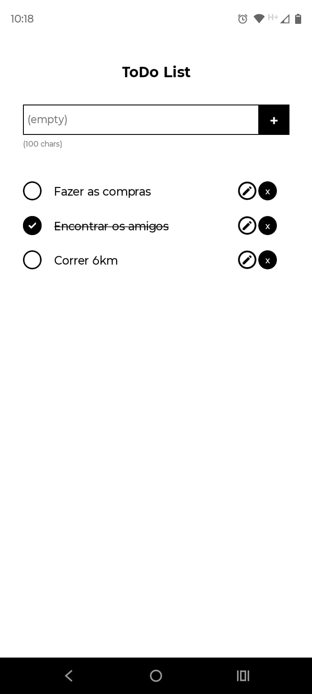

# ToDo List - React Native

Este é um simples aplicativo de lista de tarefas (ToDo List) desenvolvido utilizando **React Native**. O aplicativo permite adicionar, editar e excluir tarefas. Ele também oferece uma limitação de caracteres na entrada de texto, com um aviso quando o número máximo de caracteres é atingido.

## Aparência



## Funcionalidades

- **Adicionar tarefas**: Insira tarefas na lista com um limite de até 100 caracteres.
- **Editar tarefas**: Ao clicar para editar uma tarefa, ela é preenchida no campo de entrada e a tarefa original é removida da lista.
- **Excluir tarefas**: Você pode remover tarefas da lista ao clicar no botão de exclusão.
- **Limitação de caracteres**: O campo de entrada exibe uma mensagem de alerta quando o número máximo de caracteres (100) é atingido.

## Ferramentas e Tecnologias


- React Native
- Hooks (useState)
- FlatList (para renderizar a lista de tarefas)

## Instalação

1. **Clonando o repositório**:

   ```bash
   git clone https://github.com/seu-usuario/todolist-react-native.git
   cd todolist-react-native
   ```

2. **Instalando dependências**:

   Certifique-se de ter o [Node.js](https://nodejs.org/) e [React Native CLI](https://reactnative.dev/docs/environment-setup) instalados.

   Em seguida, instale as dependências do projeto com:

   ```bash
   npm install
   ```

3. **Executando o aplicativo**:

   Caso tenha o dispositivo Android ou iOS com o aplicativo Expo GO, execute:
   
     ```bash
     npm start
     ```

    E aponte o a câmera, com o leitor de QR Code aberto, para o QR Code que aparecer no terminal.

   Caso tenha o ambiente configurado para Android ou iOS, execute:

   - Para **Android**:

     ```bash
     npx react-native run-android
     ```

   - Para **iOS** (somente macOS):

     ```bash
     npx react-native run-ios
     ```

4. **Testando o aplicativo**:

   Após a execução bem-sucedida, o aplicativo abrirá em seu emulador/dispositivo físico. Você pode começar a adicionar, editar e excluir tarefas.

## Estrutura do Código

O código é composto pelos seguintes arquivos:

- **ToDo.tsx**: Componente principal que gerencia o estado das tarefas e da entrada de texto.
- **components/Task.tsx**: Componente que representa uma tarefa individual na lista, com opções para editar ou excluir.

## Estilos

Os estilos do aplicativo são criados usando o `StyleSheet` do React Native. A interface contém um campo de entrada para adicionar novas tarefas e uma lista exibindo as tarefas já adicionadas.

## Contribuindo

Se você quiser contribuir com melhorias, correções ou novas funcionalidades, sinta-se à vontade para abrir um **Pull Request**. Certifique-se de seguir o estilo de código e de testar suas alterações antes de enviar.